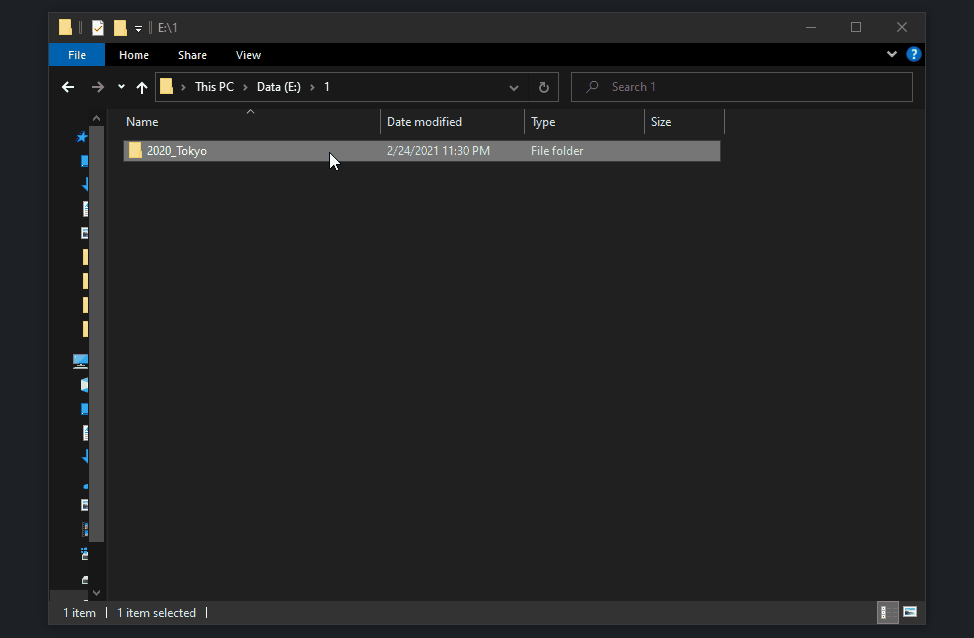

# electron-generate-album-info
An Electron app that genearte albun information(camera, roll) inside album folder
## Installation
Edit _.exe_ path under _.reg_ then double click _.reg_ to register 

## Usage
Right click on album folder, select "Gen Album Info", type text file name, camera info and roll info then press sumbmit

